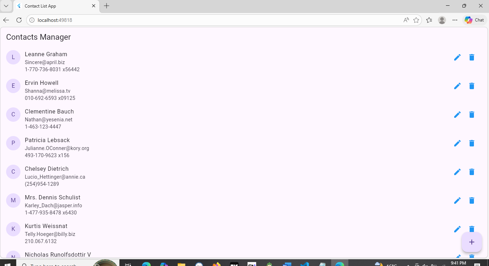
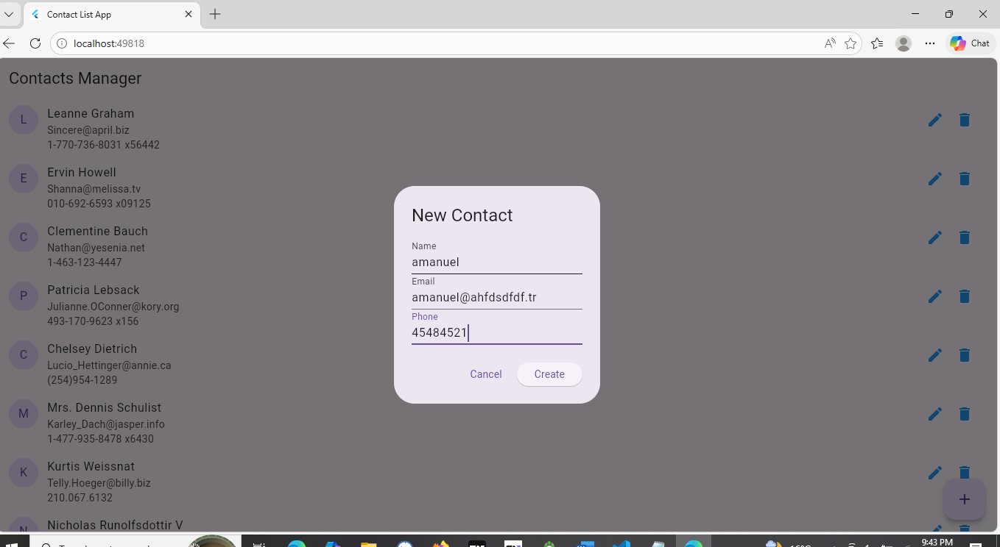
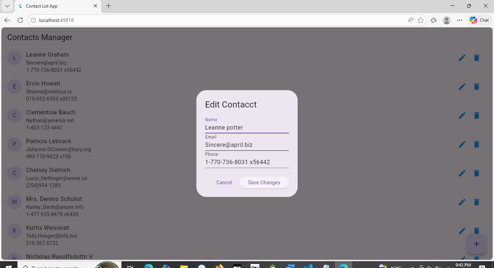
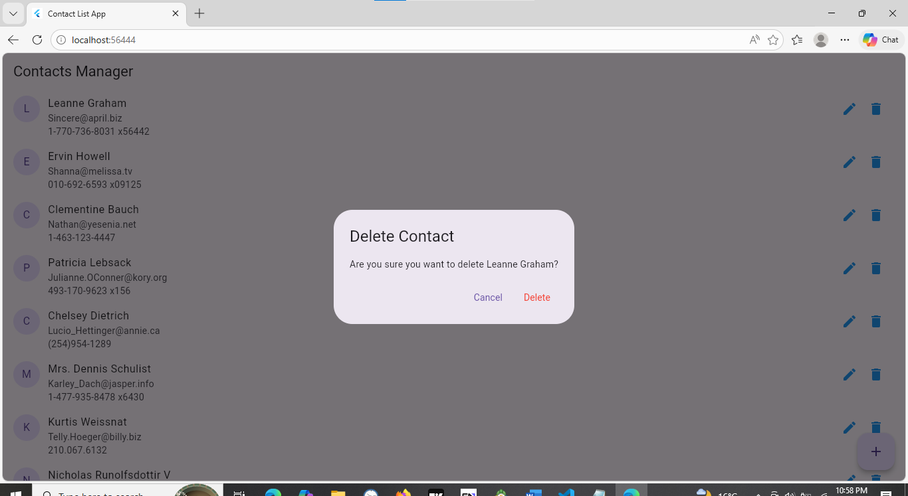

# Assignment 1: CRUD API consumption using dio and state management using Bloc

## Student information
* **Name:** Amanuel Solomon
* **ID:** UGR/0540/16
* **Section:** 2

------

# Discription about the App
A Flutter application for managing contacts, designed to demonstrate reactive state management using the **BLoC** (Business Logic Component) pattern and network requests using **Dio**.

## Features
**View Contacts:** Displays a list of all contacts with their names, emails, and phone numbers.
**Add Contacts:** Add new contacts through a dedicated dialog.
**Edit Contacts:** Update existing contact details seamlessly.
**Delete Contacts (with Confirmation):** Safely remove contacts using a delete button that prompts the user with a confirmation dialog to prevent accidental data loss.
**State Management:** Fully reactive UI driven by the `flutter_bloc` package (Loading, Loaded, and Error states).

## to run the App
1) clone
2) flutter pub get (install dependencies)
3) flutter run

## Running App screenShots

  

